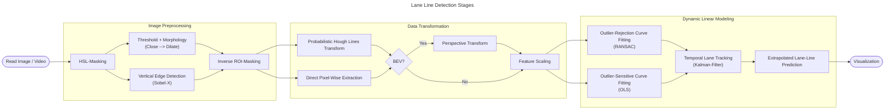

# Lane Detection

A classical computer vision approach to lane line detection that features manual **Kalman-filtering**, **RANSAC/OLS** Polynomial Regression, and **homography projection**.


See full video here: [Curved Road Lane Line Detection w/ Edge Map](https://youtu.be/AOmAQo3oTFU)

**[Try Interactive Demo (streamlit)]()**

## Table-of-Contents
- [Key Features](#key-features)
- [Quick Start](#quick-start)
- [Methodology](#methodlogy)
- [Project Structure](#project-structure)
- [Trade-Offs](#trade-offs)
- [Deep Learning Alibi](#why-not-deep-learning)
- [To-Do](#to-do)

## Key Features
### From-Scratch Implementation
- Kalman filter with adapative measurements for noise
- RANSAC with dynamic iteration calculation
- Homography via Direct Linear Transformation
    - No camera calibration or parameters required

### Production Engineering
- Modular architecture with interchangeable approaches
- Pydantic paramter configuration validation
- Comprehensive logging and testing
- Grid search hyperparamter optimization

### Performance
- **R2 Score**: 0.94-0.99, configuration dependent
- **Speed**:
- **Tested on**:
    - Straight roads
    - Curved roads
    - Worn lane lines
    - Variable lighting

[Return to TOC](#table-of-contents)

## Quick Start
### Install Package
```bash
git clone https://github.com/ShaneTeel/lane-detection-classic.git
cd lane-detection-classic
pip install -e .
```
### Run Demo Scripts
**Straight Lane Video**
```
python scripts/straight/straight_edge_direct_demo.py
```
**Curved Lane Video**
```
python scripts/curved/curved_edge_direct_demo.py
```
### For Single Video / Image processing
Define your ROI and run:
```python
from lane_detection.detection import DetectionSystem
import numpy as np

roi = np.array([[[100, 540], [900, 540], [525, 325], [445, 325]]])

system = DetectionSystem(
    source=<"filepath to video goes here">,
    roi=roi,
    generator="edge",
    selector="direct",
    estimator="ols"
)

report = system.run("composite", stroke=False, fill=True)

print(report)
```
[Return to TOC](#table-of-contents)

## Methodology

### Generalized Pipeline Overview


[Return to TOC](#table-of-contents)

## Project Structure
```
lane_detection/
|-- detection/           # Main pipeline
│   |-- models/          # OLS, RANSAC, Kalman
|-- feature_generation/  # Edge/threshold maps
|-- feature_selection/   # Point extraction
|-- scalers/             # MinMax, StandardScaler
|-- image_geometry/      # ROI mask, BEV projection
|-- studio/              # Visualization
```
[Return to TOC](#table-of-contents)

## Trade-Offs
**Feature Generation**

*Thresh*
- Amplifies both good pixel coordinates and bad pixel coordinates.
- Useful when the actual lane lines are faded / worn.

*Edge*
- Rejects noise resulting from horizontal lines
- Can generate too few points; not enough features to generate the right fit. 

**Feature Selection**

*Hough*
- Struggles with curved roads. 
- If BEV Transform were applied prior to `cv2.HoughLinesP()`, this issue is likely mitigated, but requires camera parameters (not included in this exercise).

*Direct*
- Much less resilient to outliers
- Requires special attention to the `n_std` argument to ensure outliers are filtered out appropriately.

**Estimators**

*RANSAC*
- Struggles with curved roads. 
- As polynomial degree increases, the minimum sample size needed results in an unstable fit. 
- Can reduce computational speed.

*OLS*
- Not very resistent to outliers.
- Requires a more deliberate feature generation / selection to ensure proper outliers filtering.

**BEV** (Optional)
- Aids in generating polylines that conform to the actual lane line locations.
- Reduces computational speed.
- Requires camera parameters (not included in this exercise) to improve use.

### Limitations

- Struggles with heavy road-noise (i.e., overpasses, road construction change (asphalt --> concrete))
- Requires manual ROI selection

[Return to TOC](#table-of-contents)

## Why Not Deep Learning?

This project is not meant to challenge modern approaches. It is used as a learning exercise to advance author's understanding of the following:
- Classic computer vision pipelines.
- Basic image preprocessing steps.
- Manual application of Kalman, Homography, and Regression.
- Building modular systems.

[Return to TOC](#table-of-contents)

## To-Do
- Add "Methodology" section to `README.md` with static images for each step of the pipeline
- Add unit tests for critical modules (e.g., Kalman, RANSAC, OLS).

[Return to TOC](#table-of-contents)